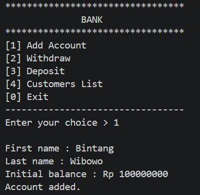
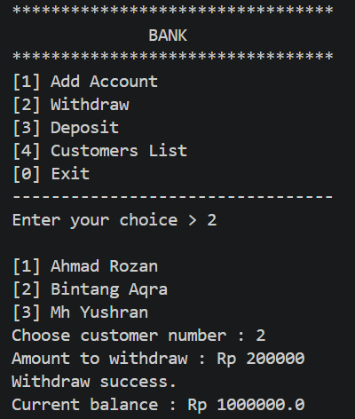
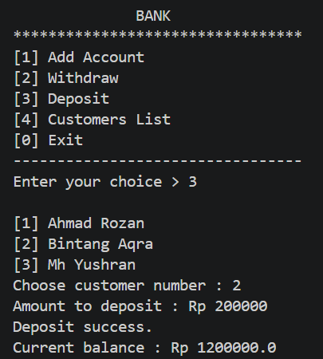
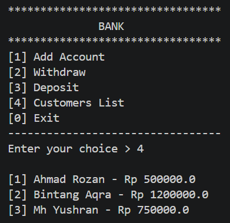
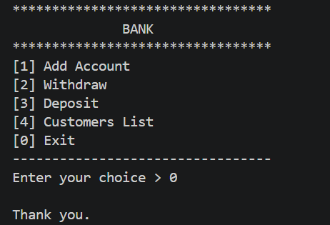

# Array and Array List Assignment

## Overview

The program starts with three customers already registered in the bank, each with an opening balance. All interaction happens through a numbered menu in the terminal, so the user can register new customers, move money in and out of an account, and view every customer.

## Class Structure

| Class      | Responsibility                                                                 |
|------------|--------------------------------------------------------------------------------|
| `Account`  | Stores the balance and provides `getBalance()`, `deposit()`, and `withdraw()`. |
| `Customer` | Stores the first name, last name, and the customer's single `Account`.         |
| `Bank`     | Keeps an array of `Customer` objects and manages adding and retrieving them.   |
| `Main`     | Runs the menu and connects user input to the classes above.                    |

## Menu Options

After launch, the program shows this menu:

1. **Add Account** – register a new customer by entering a first name, last name, and initial balance.
2. **Withdraw** – choose a customer, then enter the amount to take out.
3. **Deposit** – choose a customer, then enter the amount to put in.
4. **Customers List** – display every customer together with their current balance.
0. **Exit** – close the program.

Deposit and withdraw report whether the transaction succeeded. A deposit fails if the amount is not greater than zero, and a withdrawal fails if the amount is invalid or larger than the balance.

## Screenshots

### 1. Add Account

Entering the name and initial balance of a new customer.



### 2. Withdraw

Choosing a customer and withdrawing money from their account.



### 3. Deposit

Choosing a customer and depositing money into their account.



### 4. Customers List

Viewing all customers with their balances.



### 4. Customers List

Leaving the program.



## How to Run

Requirements: Java Development Kit (JDK) installed on your computer.

1. Open a terminal in the folder that contains the `.java` files.
2. Compile every file:

   ```bash
   javac *.java
   ```

3. Start the program from the `Main` class:

   ```bash
   java Main
   ```
