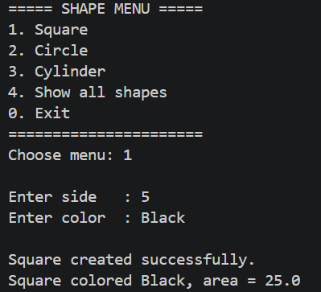
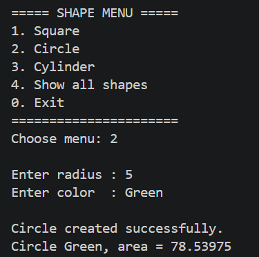
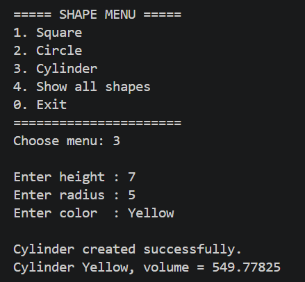
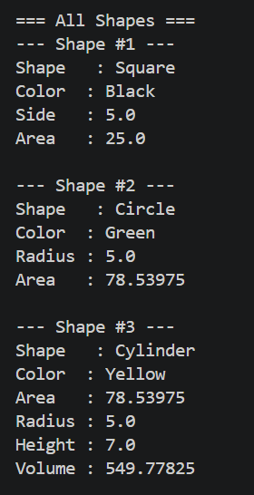
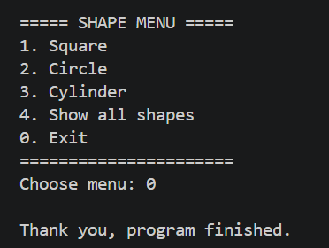

# Inheritance & Polymorphism

## Project Structure

```
src/
├── Shape.java      (superclass)
├── Square.java     (extends Shape)
├── Circle.java     (extends Shape)
├── Cylinder.java   (extends Circle)
└── Main.java       (menu and program entry point)
```

### Class Hierarchy

```
Shape
├── Square
└── Circle
    └── Cylinder
```

### Class Summary

| Class | Attributes | Main Methods |
|-------|-----------|--------------|
| `Shape` | `protected String color` | `getColor()`, `setColor()`, `printInfo()`, `printDetails()` |
| `Square` | `private double side` | `getSide()`, `setSide()`, `area()`, `printInfo()`, `printDetails()` |
| `Circle` | `protected double radius`, `PI` (`static final`, set manually to `3.14`) | `getRadius()`, `setRadius()`, `area()`, `printInfo()`, `printDetails()` |
| `Cylinder` | `private double height` | `getHeight()`, `setHeight()`, `volume()`, `printInfo()`, `printDetails()` |

## Features

The program shows a menu and keeps every created shape in a single list:

| Menu | Action |
|------|--------|
| 1 | Create a `Square` (side, color) |
| 2 | Create a `Circle` (radius, color) |
| 3 | Create a `Cylinder` (height, radius, color) |
| 4 | Show the details of all shapes created so far |
| 0 | Exit |

Input is validated: menu choices must be whole numbers, and sizes must be numbers greater than 0. A comma is accepted as a decimal separator.

---

## Concepts Used

### 1. Encapsulation

Data is hidden inside a class and accessed only through methods.

- `Square.side` and `Cylinder.height` are **private**, accessed via getters and setters.
- `Shape.color` and `Circle.radius` are **protected**, so only subclasses can use them directly. Other classes go through `getColor()`/`setColor()` and `getRadius()`/`setRadius()`.

### 2. Inheritance

A subclass reuses the attributes and methods of its superclass with `extends`.

- `Square` and `Circle` extend `Shape`, so they inherit `color` and its getter/setter. Each passes the color up with `super(color)`.
- `Cylinder` extends `Circle`, which extends `Shape` (**multilevel inheritance**). It reuses `color`, `radius`, and `area()`, and computes `volume()` as `area() * height`.

### 3. Polymorphism

Polymorphism means one method call can behave differently depending on the real type of the object. Here it is done with **method overriding**: every subclass replaces `printInfo()` (and `printDetails()`) from `Shape` with its own version.

## Screenshots

### 1. Square



### 2. Circle



### 3. Cylinder



### 4. Show All Shapes



### 5. Exit



---

## How to Run

Requires JDK 8 or newer.

```bash
javac -d bin src/*.java
java -cp bin Main
```
